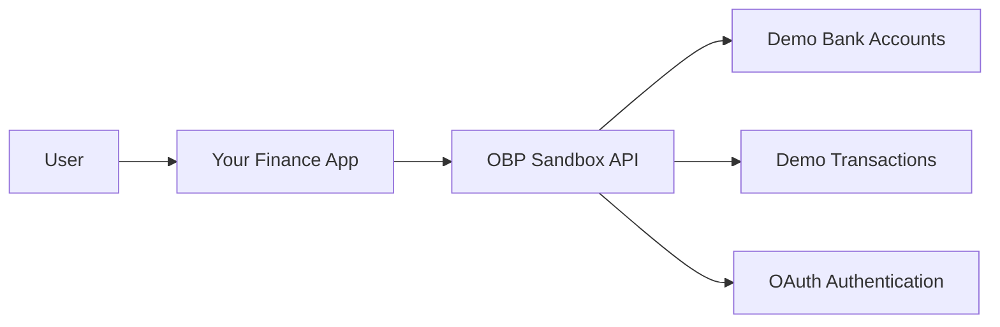

# 🏗️ Current Project Architecture & User Flow

## 🎯 **What We're Keeping & Why**

### ✅ **`budgets` - Individual Budget Management**
**What we'll use it for:**
```typescript
// Users set spending limits per category
{
  budget_name: "Groceries",
  category: "Food & Dining", 
  budget_limit: 500.00,        // $500/month limit
  period_type: "monthly",
  start_date: "2024-01-01",
  user_id: 1
}

// Link transactions to budgets for tracking
transaction.budget_id = budget.id  // Track spending against budget
```

**User Experience:**
- User sets "$500/month for Groceries"
- App tracks spending automatically from transactions
- Alerts when approaching/exceeding budget
- Shows "Spent $450/$500 this month" progress

### ✅ **`tax_records` - Tax Planning & Calculations**  
**What we'll use it for:**
```typescript
// Auto-calculate taxes from transaction data
{
  user_id: 1,
  tax_year: 2024,
  taxable_income: 75000.00,     // From income transactions
  estimated_tax: 12500.00,     // Calculated based on bracket
  tax_bracket: "22%",
  filing_status: "single",
  deductions: 15000.00,        // Business expenses from transactions
  credits: 2000.00             // Tax credits
}
```

**User Experience:**
- Auto-calculate taxes from imported/manual transactions
- "You've earned $75k, estimated tax: $12,500"  
- "Business expenses this year: $15,000 (deductible)"
- Export tax reports for accountant

---

## 💼 **Manual Investment Tracking (Current Project)**

### **How to Track Investments WITHOUT `investment_records` table:**

**Option 1: Use `financial_accounts` + `transactions`**
```typescript
// Create investment account
const investmentAccount = {
  account_name: "Fidelity 401k",
  account_type: "investment",  // existing enum value
  balance: 45000.00,          // current portfolio value
  user_id: 1
}

// Track investment transactions
const buyStock = {
  account_id: investmentAccount.id,
  amount: 1000.00,
  description: "Buy AAPL - 10 shares @ $100",
  transaction_type: "expense",  // Money out for purchase
  category: "Investment",
  tags: ["investment", "AAPL", "stock"]
}

const dividend = {
  account_id: investmentAccount.id, 
  amount: 25.00,
  description: "AAPL Dividend Payment",
  transaction_type: "income",   // Money in
  category: "Investment Income",
  tags: ["dividend", "AAPL"]
}
```

**User Experience:**
- User creates "Investment Account" 
- Manually enters buy/sell transactions
- Tracks dividends as income
- Uses tags for detailed tracking
- **Limitation:** No automatic portfolio tracking, P&L calculation

---

## 🏦 **OBP (Open Bank Project) Integration Explained**

### **What is OBP?**
- **OBP = Open Bank Project** - A sandbox/testing environment for banking APIs
- **Not a real bank** - It's a **demo banking system** for developers
- **Simulates real banking** - Accounts, transactions, OAuth flow
- **Free to use** - Perfect for building/testing finance apps

### **How OBP Works in Your Project:**



**Step-by-Step Process:**

1. **User OAuth Login to "Bank"**
   ```http
   GET /api/auth/obp/initiate  # Start OAuth flow
   # User redirected to OBP login page
   # User enters demo credentials
   # OBP redirects back with access tokens
   ```

2. **Your App Gets Bank Access**
   ```typescript
   // Store in bank_tokens table
   {
     user_id: 1,
     provider: "obp",
     access_token: "oauth_token_123",
     access_token_secret: "secret_abc",
     expires_at: "2024-12-31"
   }
   ```

3. **Sync Bank Data**
   ```http
   POST /api/banks/sync/accounts     # Import demo accounts
   POST /api/banks/sync/transactions # Import demo transactions
   ```

4. **Data Flows to Your Database**
   ```typescript
   // Creates real records in your database
   financial_accounts: [
     { account_name: "OBP Checking", balance: 2500.00, external_account_id: "obp_123" }
   ]
   transactions: [
     { description: "Coffee Shop", amount: 4.50, tags: ["imported", "obp"] }
   ]
   ```

### **Demo vs Real Banking:**
- **Current:** OBP provides **demo data** (fake transactions)
- **Future:** Replace with **Plaid/Yodlee** for real banks
- **Same codebase** - just change the service integration

---

## 🎨 **Frontend User Experience Flow**

### **Complete User Journey:**

#### **1. Registration & Setup**
```typescript
// Frontend pages needed:
/register     → Create account
/login        → Get JWT token  
/dashboard    → Main finance dashboard
/connect-bank → OBP OAuth flow
```

#### **2. Bank Connection Flow**
```javascript
// User clicks "Connect Bank Account"
const connectBank = async () => {
  // 1. Redirect to OBP OAuth
  window.location.href = '/api/auth/obp/initiate'
  
  // 2. User logs into demo bank
  // 3. Returns to your app with tokens
  
  // 4. Trigger account sync
  await fetch('/api/banks/sync/accounts', {
    method: 'POST',
    headers: { Authorization: `Bearer ${jwtToken}` }
  })
}
```

#### **3. Dashboard Experience**
```javascript
// Dashboard shows:
const Dashboard = () => {
  const [accounts, setAccounts] = useState([])
  const [transactions, setTransactions] = useState([])
  const [budgets, setBudgets] = useState([])
  
  useEffect(() => {
    // Load user's financial data
    fetchAccounts()    // Shows bank balances
    fetchTransactions() // Shows spending history  
    fetchBudgets()     // Shows budget progress
    fetchTaxEstimate() // Shows tax calculations
  }, [])
  
  return (
    <div>
      <AccountsWidget accounts={accounts} />
      <TransactionsWidget transactions={transactions} />
      <BudgetsWidget budgets={budgets} />
      <TaxEstimateWidget />
    </div>
  )
}
```

#### **4. Key Frontend Features**
```typescript
// Account Management
GET /api/accounts              → Display account balances
POST /api/accounts            → Add manual accounts

// Transaction Tracking  
GET /api/transactions         → Show transaction history
POST /api/transactions        → Add manual transactions
POST /api/banks/sync/all      → Import from banks

// Budget Management (TO IMPLEMENT)
GET /api/budgets              → Show budget progress
POST /api/budgets             → Create new budgets

// Tax Features (TO IMPLEMENT) 
GET /api/tax/estimate/2024    → Show tax estimate
GET /api/tax/export/2024      → Download tax report
```

---

## 🚀 **Current Project Status**

### **✅ WORKING FEATURES:**
- User authentication (JWT)
- Manual transaction CRUD
- Financial accounts management
- **OBP integration** (OAuth + data sync)
- **Automatic transaction import**

### **🔄 READY TO IMPLEMENT:**
- Budget tracking & alerts
- Tax calculations & reports  
- Manual investment tracking

### **📱 FRONTEND NEEDED:**
- React/Vue/Angular dashboard
- Bank connection UI
- Transaction management
- Budget visualization
- Tax reporting interface

---

## 🎯 **Next: Tax Records Implementation**

Let's implement the tax functionality to give your app a **huge competitive advantage**!

Tax features will include:
- Auto-calculate taxes from transaction data
- Track deductible expenses
- Generate tax reports
- Quarterly estimates
- Multi-year tax planning

Ready to start with the tax implementation? 